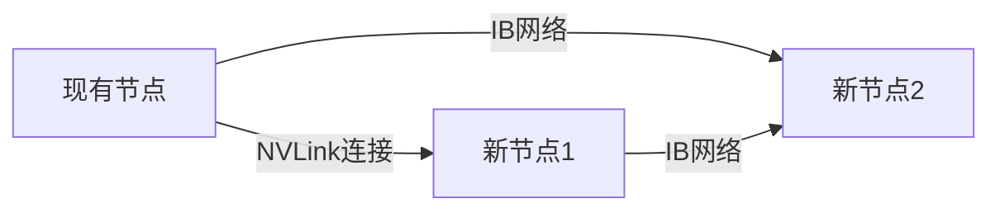
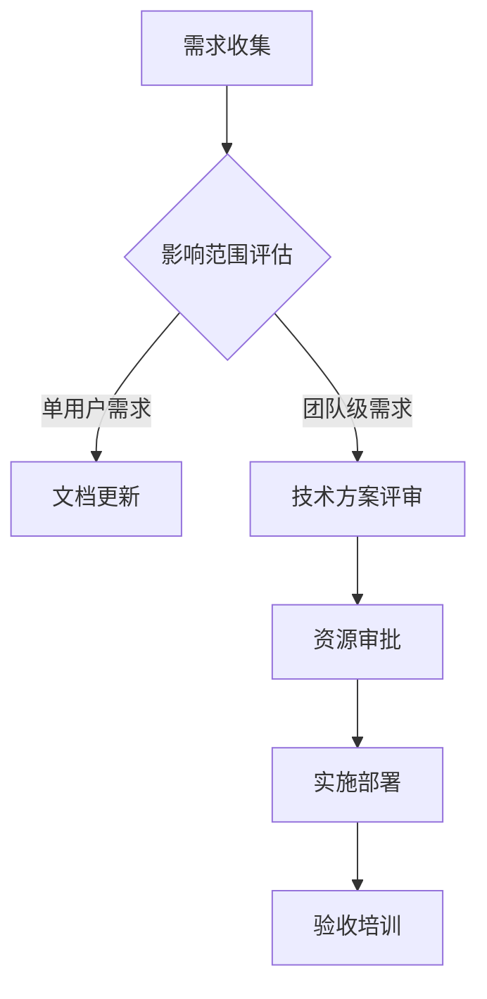

# 实验室服务器扩展计划

## 当前架构现状
- **用户规模**：10人以内小型团队  
- **硬件配置**：单节点8卡RTX 4090服务器  
- **调度需求**：基础任务分配，无优先级控制  
- **管理复杂度**：低（人工协调为主）

---

## 扩展路线图

### 阶段一：基础优化（用户<20人）
| 功能模块          | 实施内容                                                                 | 预期效益                           | 先决条件                 |
|-------------------|--------------------------------------------------------------------------|-----------------------------------|--------------------------|
| **日志分析系统**  | 部署ELK Stack集中管理日志<br>配置自动告警规则                             | 故障排查效率提升50%                | 分配4核CPU/16GB内存资源  |
| **备份策略升级**  | 实现BorgBackup增量备份<br>增加云存储同步功能                              | RPO从24小时缩短至1小时             | 采购阿里云OSS存储包      |
| **容器镜像仓库**  | 搭建Harbor私有仓库<br>支持GPU镜像版本管理                                 | 镜像分发速度提升3倍                | 部署独立存储节点         |

### 阶段二：集群化管理（用户20-50人）
| 功能模块              | 实施内容                                                                 | 适用场景                           | 触发条件                 |
|-----------------------|--------------------------------------------------------------------------|-----------------------------------|--------------------------|
| **Slurm调度系统**     | 部署基础版Slurm集群<br>实现GPU资源队列分配                               | 多项目并行时资源争用管理           | 并发任务数>20            |
| **分布式存储**       | 部署Ceph集群<br>提供POSIX接口的共享存储                                  | 多用户数据集共享需求               | 存储需求>100TB           |
| **容器编排平台**      | 部署Kubernetes集群<br>集成NVIDIA device plugin                           | 深度学习流水线自动化               | 容器化应用占比>60%       |

### 阶段三：高级功能扩展（用户>50人）
| 功能模块              | 技术方案                                                                 | 预期效果                           | 依赖条件                 |
|-----------------------|--------------------------------------------------------------------------|-----------------------------------|--------------------------|
| **GPU虚拟化**         | 部署vGPU方案（如vComputeServer）<br>实现显存/算力分片                    | GPU利用率提升至85%+               | 采购NVIDIA企业级授权     |
| **服务网格**          | 集成Istio服务网格<br>实现模型服务灰度发布                                 | 在线服务SLA提升至99.95%            | 微服务架构转型完成       |
| **混合云集成**        | 搭建AWS Outposts/Hybrid集群<br>实现负载溢出到公有云                       | 突发算力需求快速响应               | 获得混合云建设预算       |

---

## 候选技术栈清单

### 资源调度
- [x] Slurm Workload Manager（基础调度）
- [ ] YARN + Capacity Scheduler（多租户隔离）
- [ ] Kubernetes + Volcano（云原生调度）

### 监控分析
- [x] Prometheus + Grafana（已部署）
- [ ] Datadog APM（应用性能追踪）
- [ ] NVIDIA DCGM（高级GPU诊断）

### 数据管理
- [ ] Pachyderm（数据版本控制）
- [ ] Alluxio（内存加速层）
- [ ] Delta Lake（数据湖管理）

---

## 硬件扩展预案

### 横向扩展方案


### 纵向升级预案
| 组件          | 升级路径                          | 触发阈值              |
|---------------|-----------------------------------|-----------------------|
| GPU           | RTX 4090 → H100 80GB              | 单卡显存使用率>90%    |
| 网络          | 10GbE → 100Gb InfiniBand          | 节点间流量>8Gbps      |
| 存储          | NVMe SSD → Optane持久内存         | IO延迟>5ms的请求占20% |

---

## 智能运维功能规划

### 自动化场景
```python
# 伪代码示例：自动弹性扩缩容
def auto_scaling():
    while True:
        gpu_util = get_gpu_utilization()
        if gpu_util > 85%:
            spin_up_cloud_node()  # 触发云节点扩容
        elif gpu_util < 30%:
            release_idle_nodes() # 释放空闲节点
        sleep(300)
```

### AIOps能力建设
1. **故障预测**：基于LSTM模型分析历史日志，预测硬件故障
2. **资源推荐**：根据用户历史任务，推荐最佳GPU配置
3. **异常检测**：实时监控参数梯度，发现训练异常

---

## 实施优先级评估
```stata
+------------------+----------+------------+
| 功能模块         | 紧急程度 | 实施难度   |
+------------------+----------+------------+
| 容器镜像仓库     | ★★★☆☆    | ★★☆☆☆      |
| Slurm基础调度    | ★★☆☆☆     | ★★★☆☆      |
| 分布式存储       | ★☆☆☆☆     | ★★★★☆      |
| 混合云集成       | ★☆☆☆☆     | ★★★★★      |
+------------------+----------+------------+
```

---

## 扩展决策流程

