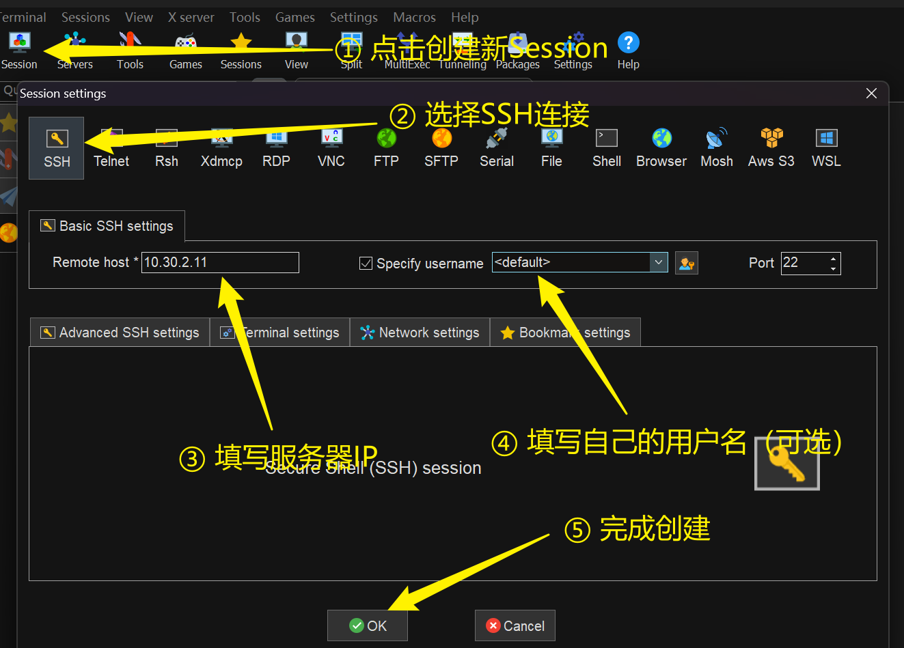
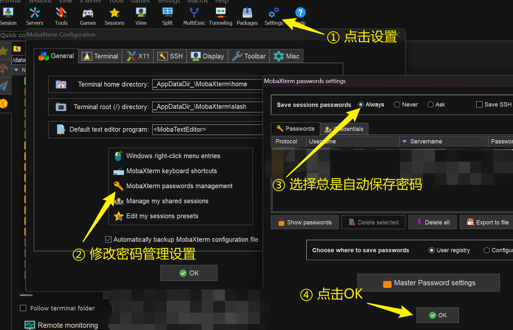
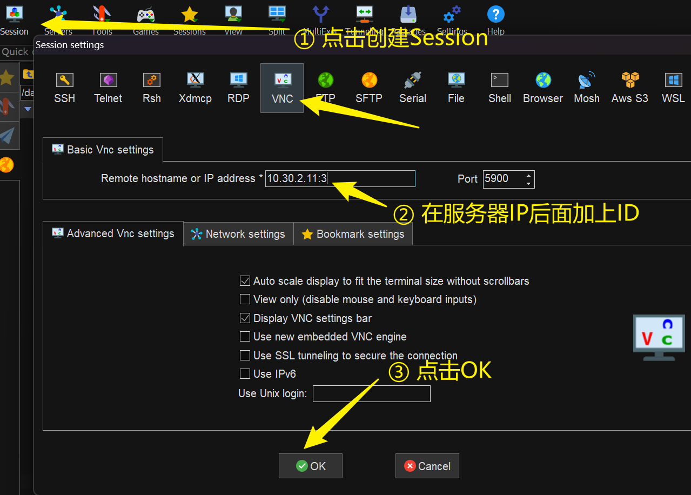

# 服务器快速使用指南

## 一、远程连接工具准备
推荐使用以下工具进行服务器连接（任选其一）：

1. MobaXterm - 集成SSH连接、SFTP传输及X11转发的综合性工具  
   [官方下载地址](https://mobaxterm.mobatek.net/)
2. VS Code - 支持SSH远程开发的轻量级编辑器  
   [扩展安装指南](https://code.visualstudio.com/docs/remote/ssh)
3. WindTerm - 开源免费的SSH/Telnet客户端  
   [GitHub仓库](https://github.com/kingToolbox/WindTerm)

## 二、SSH连接配置（以MobaXterm为例）

### 1. 新建会话  

- 启动MobaXterm点击左上角"Session"
- 选择SSH协议，填写服务器IP地址
- 勾选"Specify username"输入账户名（可选）



### 2. 安全验证设置

- 点击设置
- 修改密码管理设置
- 推荐选择总是自动保存密码



## 三、VNC可视化环境配置
### 1. 启动VNC服务

```bash
$ vncserver
```

```terminal
New Xtigervnc server 'ta:3 (guorun)' on port 5903 for display :3.
Use xtigervncviewer -SecurityTypes VncAuth,TLSVnc -passwd /data/home/guorun/.vnc/passwd ta:3 to connect to the VNC server.
```

- 关键参数说明：
   - `:3` 表示显示编号（对应端口5903）
   - 密码文件路径：`/home/username/.vnc/passwd`


### 2. 连接VNC会话

- 新建VNC类型会话（图3）
- 地址格式：`IP地址:显示编号`（示例：`192.168.1.100:3`）
- 输入VNC服务密码（首次需在SSH终端通过`vncpasswd`设置）



## 四、连接管理建议

### 1. 端口对应规则  

- VNC显示编号与端口号对应关系：`:n` → `5900+n`

### 2. 服务管理命令  

```bash
$ vncserver -list      # 查看活动会话
$ vncserver -kill :n   # 终止指定会话
```

### 3. 安全注意事项

- 临时会话使用后及时关闭
- 避免使用简单VNC密码
- 建议通过SSH隧道建立加密连接


### 4. 常见问题排查

- VNC黑屏尝试重启服务：

```bash
$ vncserver -kill :n && vncserver
```

- 分辨率设置：

```bash
$ vncserver -geometry 1920x1080
```