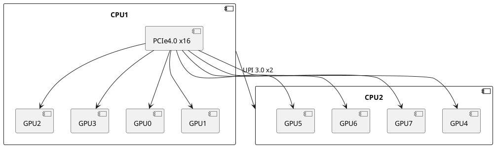

# 服务器硬件配置手册

## 1. 核心硬件配置清单

### 1.1 计算单元
| 组件       | 规格参数                          | 数量 | 备注                  |
|------------|----------------------------------|------|-----------------------|
| CPU        | Intel Xeon Gold 6338 2.0GHz      | 2    | 32核心/64线程         |
| 内存       | DDR4 3200MHz ECC RDIMM           | 16   | 16x32GB=512GB         |
| GPU        | NVIDIA GeForce RTX 4090          | 8    | 24GB GDDR6X 每卡       |
| 存储系统   | - 主存储: Samsung PM1733 4TB NVMe<br>- 扩展存储: Seagate Exos 16TB HDD | 2+4  | RAID 1 (NVMe)<br>RAID 5 (HDD) |

### 1.2 物理参数
```plaintext
• 机架规格: 4U标准机架式
• 尺寸: 178mm(H) x 482mm(W) x 750mm(D)
• 重量: 38.5kg (满载)
• 散热系统: 8组涡轮风扇+液冷备用接口
```

## 2. 硬件架构拓扑

### 2.1 物理布局图


### 2.2 PCIe通道分配


## 3. 网络配置

### 3.1 网络接口卡
| 网口 | 型号                  | 速率   | 用途               |
|------|-----------------------|--------|--------------------|
| NIC1 | Mellanox ConnectX-6   | 100GbE | 高速计算网络       |
| NIC2 | Intel X710-T4L        | 10GbE  | 管理/存储网络      |

### 3.2 网络拓扑
```plaintext
1. 计算节点通过100GbE连接至InfiniBand交换机
2. 管理网络独立接入实验室内网
3. 存储网络通过10GbE连接NAS设备
```

## 4. 电源与功耗

### 4.1 电源配置
```plaintext
• 电源模块: 冗余双电源 2000W
• 输入电压: 200-240V AC
• 典型功耗: 1600W (满载)
• 峰值功耗: 1850W (瞬时)
```

### 4.2 电力需求计算器
```bash
# 估算功耗（需要安装ipmi工具）
ipmi-dcmi --get-system-power-statistics
```

## 5. 硬件监控

### 5.1 传感器列表
```bash
# 查看温度传感器
sensors | grep -E "(Package|Core|GPU)"
```

### 5.2 关键阈值
| 监测项       | 正常范围    | 警告阈值 | 紧急阈值 |
|--------------|------------|----------|----------|
| CPU温度      | 40-75℃     | 85℃      | 95℃      |
| GPU核心温度  | 50-80℃     | 88℃      | 92℃      |
| 风扇转速     | 8000-12000 RPM | <7000 RPM | <5000 RPM |

## 6. 物理接口说明

### 6.1 前面板布局
```plaintext
[ 电源按钮 | 状态LED | USB 3.2 x4 | 热插拔盘位x8 ]
```

### 6.2 后置接口
```plaintext
1. 网络接口: 100GbE SFP28 x2 / RJ45 x4
2. 管理接口: iDRAC9 专用端口
3. 显示输出: HDMI 2.1 x2 (对应GPU0/GPU4)
```

## 7. 固件版本

### 7.1 当前版本信息
| 组件       | 固件版本     | 发布日期   |
|------------|-------------|------------|
| BIOS       | 2.8.1       | 2023-06-01 |
| BMC        | 5.10.00.00  | 2023-05-15 |
| GPU VBIOS  | 94.02.71.00 | 2023-03-22 |

### 7.2 更新方法
```bash
# 示例：更新BIOS
./BIOS_Update_2.8.1.bin -q
```

## 8. 硬件兼容性

### 8.1 已验证设备
```plaintext
• 扩展卡: PCIe4.0 NVMe扩展卡 (型号: AORUS Gen4 AIC Adaptor)
• 存储设备: Samsung 980 Pro 2TB (作为缓存盘)
```

### 8.2 不兼容列表
```plaintext
1. 第三方PCIe拆分卡 (需使用原厂配件)
2. 非ECC内存模块
```

---

## 附录

### 硬件检测命令速查
```bash
# 查看CPU信息
lscpu

# 查看内存配置
dmidecode -t memory

# 检查PCIe拓扑
lspci -tv

# GPU详细参数
nvidia-smi -q
```

### 维护联系人
- 硬件支持: 张三 (zhangsan@lab.com | 138-1234-5678)
- 厂商服务: Dell ProSupport 800-888-8888