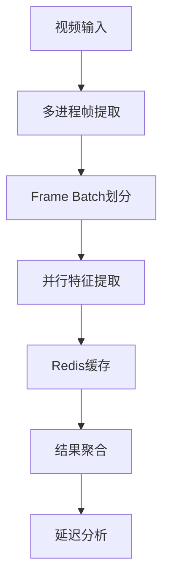

# 视频理解流水线技术文档



## 1. OpenCV帧提取多进程模板
```python
import cv2
import os
from multiprocessing import Pool

def extract_frames(video_path, start_frame, end_frame, output_dir):
    cap = cv2.VideoCapture(video_path)
    cap.set(cv2.CAP_PROP_POS_FRAMES, start_frame)
    pid = os.getpid()
    
    for i in range(start_frame, end_frame):
        ret, frame = cap.read()
        if not ret: break
        cv2.imwrite(f"{output_dir}/frame_{pid}_{i:06d}.jpg", frame)
    
    cap.release()

if __name__ == "__main__":
    video_path = "input.mp4"
    output_dir = "frames"
    os.makedirs(output_dir, exist_ok=True)
    
    cap = cv2.VideoCapture(video_path)
    total_frames = int(cap.get(cv2.CAP_PROP_FRAME_COUNT))
    cap.release()
    
    num_processes = 4
    chunk_size = total_frames // num_processes
    ranges = [(i*chunk_size, (i+1)*chunk_size) for i in range(num_processes)]
    
    with Pool(num_processes) as p:
        p.starmap(extract_frames, [
            (video_path, start, end, output_dir) 
            for start, end in ranges
        ])
```

## 2. 特征提取并行化方案
**Frame Batch划分策略：**
```python
import torch
from torch.utils.data import Dataset, DataLoader

class FrameDataset(Dataset):
    def __init__(self, frame_dir, batch_size=32):
        self.frames = sorted(os.listdir(frame_dir))
        self.batch_size = batch_size

    def __len__(self):
        return len(self.frames) // self.batch_size

    def __getitem__(self, idx):
        batch = self.frames[idx*self.batch_size : (idx+1)*self.batch_size]
        return torch.stack([preprocess(f) for f in batch])

# 多GPU数据并行
model = torch.nn.DataParallel(ResNet50())
loader = DataLoader(FrameDataset("frames"), 
                   num_workers=4, 
                   pin_memory=True)
```

## 3. Redis缓存配置
```conf
# redis.conf
maxmemory 4gb
maxmemory-policy allkeys-lru
save ""
appendonly no
```
关键参数说明：
• `maxmemory`: 根据服务器物理内存的70%设置
• `淘汰策略`: allkeys-lru保证最新热数据保留
• 关闭持久化提升吞吐量

## 4. 端到端延迟测试方法
```python
import time

class TimeTracker:
    def __init__(self):
        self.timestamps = {}
    
    def mark(self, name):
        self.timestamps[name] = time.perf_counter()

def process_pipeline():
    tracker = TimeTracker()
    tracker.mark("start")
    
    # 帧提取阶段
    extract_frames(...)
    tracker.mark("frame_extract")
    
    # 特征提取阶段
    extract_features(...)
    tracker.mark("feature_extract")
    
    # 结果存储
    save_results(...)
    tracker.mark("end")
    
    # 计算各阶段耗时
    return {
        "total": tracker.timestamps["end"] - tracker.timestamps["start"],
        "extract": tracker.timestamps["feature_extract"] - tracker.timestamps["frame_extract"]
    }
```

## 显存占用对照表
| 分辨率  | Batch Size | FP32显存 | FP16显存 |
|---------|------------|----------|----------|
| 360p    | 64         | 5.2GB    | 3.1GB    |
| 720p    | 32         | 6.8GB    | 4.0GB    |
| 1080p   | 16         | 7.5GB    | 4.5GB    |
| 4K      | 4          | 8.2GB    | 5.0GB    |

> 测试环境：NVIDIA V100 32GB，ResNet-50模型

**优化建议：**
1. 使用混合精度训练减少30-50%显存占用
2. 动态Batch策略根据分辨率自动调整
3. 使用梯度检查点技术处理超大分辨率